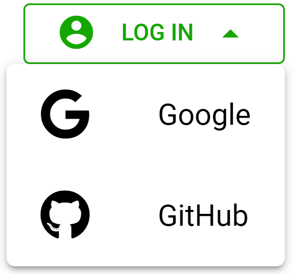
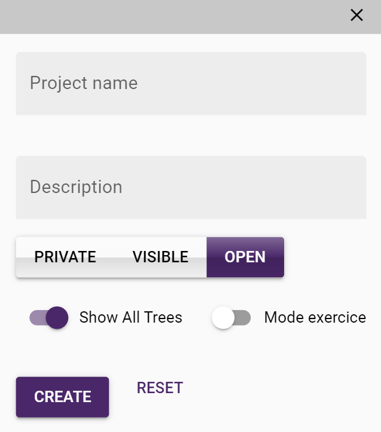
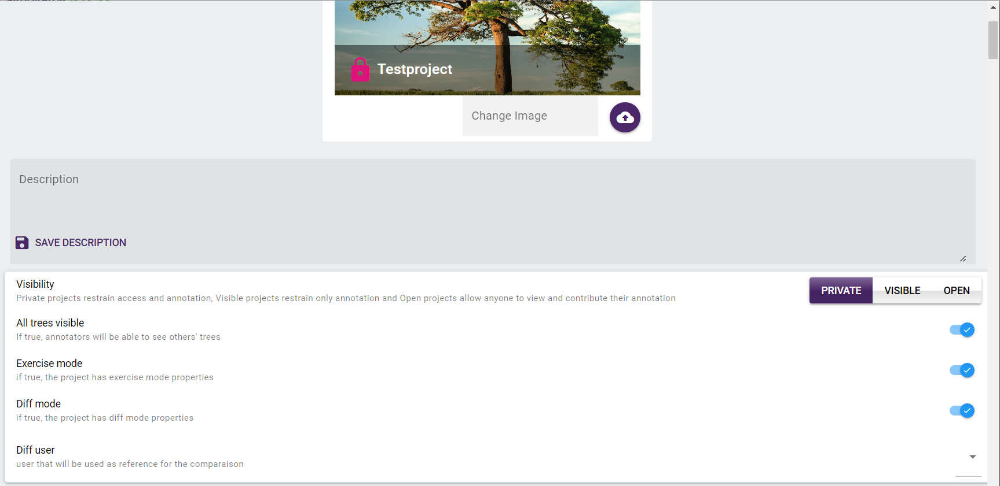
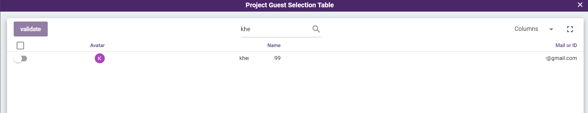
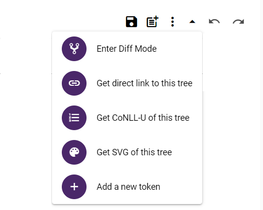
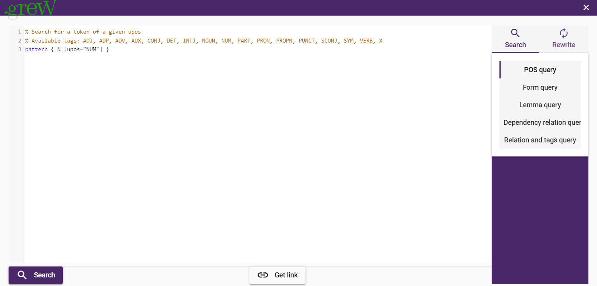
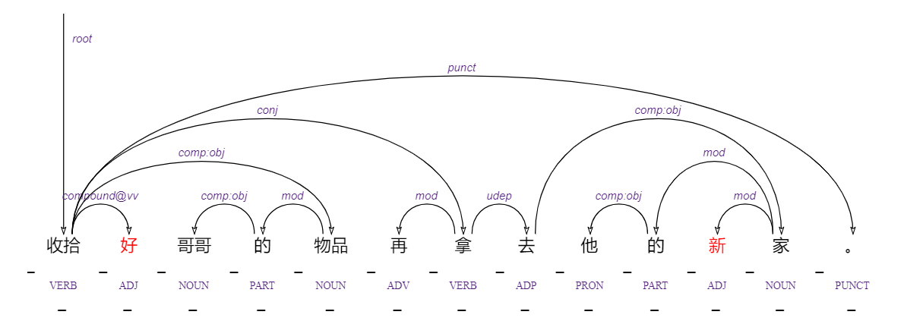
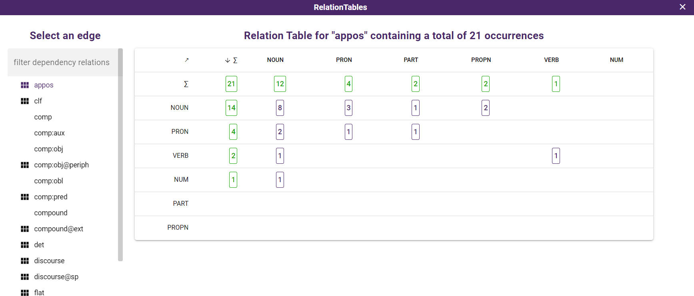

## Welcome to Arborator Grew Documentation

This is the official user documentation for **[Arborator Grew](https://arboratorgrew.elizia.net/#/)**

?> A **collaborative annotation** tool for the **treebank** developpement. 

Below is brief summary of Arborator's main features and user cases. For more details and tutorials, use the navigation bar on the left. 

Let's have a look at the documentation.

## Main Features

Arborator-Grew combines the features of two preexisting tools: `Arborator` and `Grew`. 

> **[Arborator](https://arborator.ilpga.fr/)** is a widely used collaborative graphical online dependency treebank
annotation tool. 

> **[Grew](https://grew.fr/)** is a tool for graph querying and rewriting specialized in structures needed in NLP, i.e. syntactic and semantic
dependency trees and graphs. Grew also has an online version, **[Grew-match](http://match.grew.fr/)**, where all Universal Dependencies treebanks in their classical,
deep and surface-syntactic flavors can be queried.

> **[Arborator Grew](https://arboratorgrew.elizia.net/#/)** opens up new paths of collectively
creating, updating, maintaining, and curating syntactic treebanks and semantic graph banks.

> **[Arborator Grew](https://arboratorgrew.elizia.net/#/)** is adapted better to
**[UD Universal Dependencies](https://universaldependencies.org/)** (Treebank annotation grammar) and **[SUD Surface Syntactic Universal Dependencies](https://surfacesyntacticud.github.io/)** (Distribution based version of UD).

# User Guide 

## Login 

Instead of creating a new account, Arborator-Grew simplifies registration and login for end users.
Arborator-Grew works with two types of social login using  **[Google]()** and **[Github](https://github.com/login)**. 

Use the top right button to select the corresponding social login.

## Create a new project 

Arborator-Grew provides new ways to collectively
create, update, maintain and curate syntax treebanks and semantic graph banks. Arborator-Grew makes it easy to create new project and work with collaborators.

You have the possibility to create `Private` project to work on individually or with invited collaborators. Besides that, you can publish the project and make it `Visible` for everyone to see and download or set it as an `Open` project so everyone can collaborate.

To create new project, you start by navigating to the **[Projects list](https://arboratorgrew.elizia.net/#/projects)**. You will find there add button, click on it to open the new project modal.

The required fields to create new project on Arborator-Grew in descending order are: 

- The **Project name**, it is what will appear in the projects list and what you will use for browsing .
- The **Description**, it is an overview of the project that outlines its different details. A good description is extremely helpful for the community who are looking for collaboration.
- The **Project Visibility**, projects may be Private (visible and editable only to you and your collaborators) or Visible (only visible) or Open (everyone can contribute).
- **Show All Trees**, this option enable you to see other's trees.
- **Mode exercice**, this will set up the exercice propreties, explained [here](#exercise-mode).

Once you have provided the required information alongside your project, click on “Create” and your project will be created.

## Project Configuration
Once the project is created the adminstrator can configure the following settings:

- The visibility control, the adminstrator can update the visibility of the project.
- The adminstartor can also update trees' visibility, Exercise mode, Diff mode.
- The adminstartor can select user to be used as a reference for the comparaison.
- In order to maximize the usefulness of the project, you can upload cover image and add description.

## Collaborating in projects 

Collaborative annotation is one of powerful features of Arborator-Grew. It provides a way to multiple users to share the access of the project so they can work together.

When you create a project, you are  assigned as the owner and the **administrator** of the dataset. An **administrator** can change the status of the
project, and admit and assign other users (administrators, validators, and annotators). They can also upload new samples to the project, create exercises, and determine the POS and relational tagsets.

?> Also, we can distinguish the following roles:

- `Guest` If the project is
public, **guests** can browse and query, but not modify
the treebank.
- `Annotator` Each sample has a list of **annotators**. **Annotators** can browse and modify the treebank (modify in the sense that a modified tree is saved under their name). 

- `Validators` of a sample can see all the trees and choose
the correct version if the annotators disagree.

### Inviting Collaborators

You can directly invitating collaborators to your project by browsing to the project settings. You can choose to invite adminstrators, annotators or other guests. There, click on add button you will find a list of different users of the system you can select and add other user collaborators or and use the search field to find them.

## Treebank Graphic Annotation

To get started with the treebank annotation, you need to import `CoNLL` file as an input. Arborator translates any `CoNLL` data inside `<conll>` tags into graphical trees. In the annotation user interface: 

?> To make a dependency relation between two tokens, you just need to pull the bow from the token to the other. 

?> To create the root dependency, you need to pull up the bow from  the token. 

?> To change the token's features, you click on it and you can choose and set different features  of `Universal Features` and `Miscellaneous Features` and `Lemmas`

?> To assign a category for the token, you click on the underscore and select the approriate category.

?> To delete annotation, the purple delete button will allow you to delete the different parts of annotation mentionned above.

<video autoplay loop width="900">
      <source src="assets/videos/1-Annotation.webm" type=video/webm>
</video>

### Annotation Functionnalities

There is a toolbar located on the top  left of the document area. From it the user can perform these actions:

- Each time a change is made in the tree (e.g. new annotation or relation added), yellow diskette will appear to indicate there are changes to **save**. Click on the **Save button** to **save** the changes. 

- You can edit the meta data related to the sentence. 

- You have also the possibility to get a direct `link`, `SVG` file and `CONLL` of the tree.

- You can add a new token to the tree. Besides that, you can undo and redo changes.

## Advanced Options

### Grew search

One of the powerful features of Arborator grew is the pattern matching system. Arborator uses **[Grew](https://grew.fr/)**.

?> You can search based on `POS query`, `Form query`, `Lemma query`, `Dependency relation query` and `Relation and tags query`

?> The nodes that match the pattern are then highlighted in the
trees on the results page.

!> In order to detect the errors, it can filter out these results based on negative
patterns (patterns that must not appear in the graph). Once the faulty tree has been found, it  can then directly be
edited and saved.

### Relation tables

Grew also has the ability to cluster
the results of a query based on one or several features. 

?> This functionality can be used to build a relation table which
summarizes all dependencies within a project, based on the dependency relation. 

 

!> Having this is a great way to look for
rare structures and potential errors inside a treebank. The user can access
directly the trees that match the negative pattern and update it. 

## Classroom

**[Arborator-Grew](https://arboratorgrew.elizia.net/#)** comes with the concept of the **Classroom**, which is a  great way to teach the undergraduate and graduate students **syntax** using treebank annotation. 

?> Thus, **[Arborator-Grew](https://arboratorgrew.elizia.net/#)** allows the configuration of Exercise mode.

### Exercise mode

This option is set up while the creation of project or using the setting button (Gear button). 

!> Teachers need to have an [administrator](#collaborating-in-projects) status in the project in order to set up an exercise.

For each sample of the project you can configure the exercise mode and determine a **base tree** per sentence that will be used to feedback and calculate the students' scores. The details of different exercise mode are explained below: 

| Exercise level     |property  |
| ------------------- |--------------------------------------------------------------------------  |
| `1:teacher_visible`| 
the students can see the reference tree, but cannot modify it directly – they have to redraw the tree from an empty annotation   
    |
| `2:local_feedback`|        |
|`3:global_feedback`|         |
|`4:no_feedback`|
 where only the teacher can receive the student’s score.
|

?> The teacher can export the results of the students into spreadsheets.

